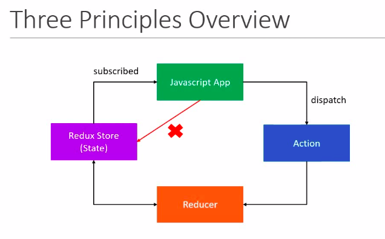

# my-redux-app

redux + redux toolkit

### Intro

- React is a library used to build user interfaces.
- Redux is a library for managing state in a predictable way in javascript applications.
- Redux toolkit is a library for efficient redux development.
- React-redux is a library that provides bindings to use React and Redux(Redux toolkit) together in an application.

When should I use redux in my react applications ?

- You have large amounts of application state that are needed in many places in the app.
- The app state is updated frequently over time.
- The logic to update that state may be complex.
- The app has a medium or large-sized codebase, and might be worked on by many people

When should not use redux in my applicaton ?

Learning path

- learn redux first
- learn redux toolkit second
- learn react + redux third

### Redux project setup - with vannila javascript

- create a js project
- npm init
- install redux => npm i redux

### Three Core Concpets in Redux

---

Real world Scenario

#### Cake Shop

Entities Activites

Shop --> Stores cakes on a shelf Customer - Order a cake
Shokeeper --> Behind the counter Shopkeeper - Pack a cake from shelf and keep track of shelf
Customer --> At the store entrance

---

Cake Shop Scenario Redux Purpose

Shop Store Holds the state of your application
Cake Ordered Action Describes what happened
Shopkeeper Reducer Ties the store and actions together

- A Store that holds the state of your application
- An action that describes what happened in that application
- A reducer which handles the action and decides how to update the state

### Three Principles of redux

1. First Principle

"The global state of your application is stored as an object inside a single store"

Means, Maintain our application state in a single object which would be managed by the Redux store

Cake Shop scenario
Let's assume we are tracking the number of cakes on the shelf

store object look like this:

```
{
    numberOfCakes:10
}
```

2. Second Principle
   "The only way to change the state is to dispatch(send) an action, an object that describes what happened"

To update the state of your app, you need to let Redux know about that with an action.
We are not allowed to direclty update the state object.

Cake Shop Scenario:
We scan the QR code and place an order(placing order is action), CAKE_ORDERED(action name).

action object look like this:

```
{
    type: "CAKE_ORDERED"
}
```

3. Third Principle
   "To specify how the state tree(object) is updated based on actions, you write pure reducers"

- reducer is pure javascript function
- reducer will take previous state and action and returns new state

```
const reducer = (state = initialState, action)=>{
    if(action.type=="CAKE_ORDERED"){
        return {
            numOfCakes: state.numOfcakes -1
        }
    }
}
```

Cake Shop
Reducer is the shopkeeper

- As a customer we cann't take cake direclty from shelf and update it's number.
- So, we just make an action called CAKE_ORDERED.
- Shopkeeper will rececive that order and based on the order, he will update the shelf

Overview

